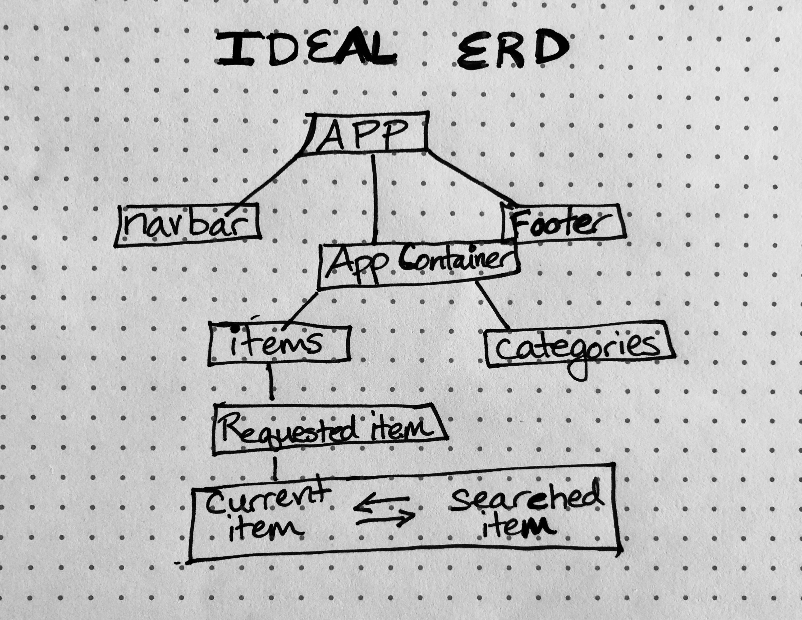
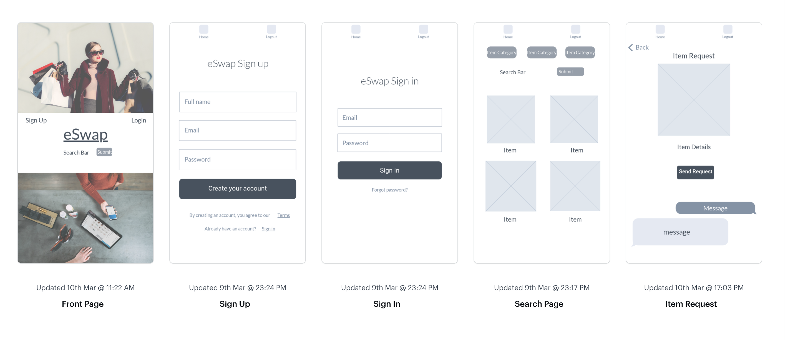
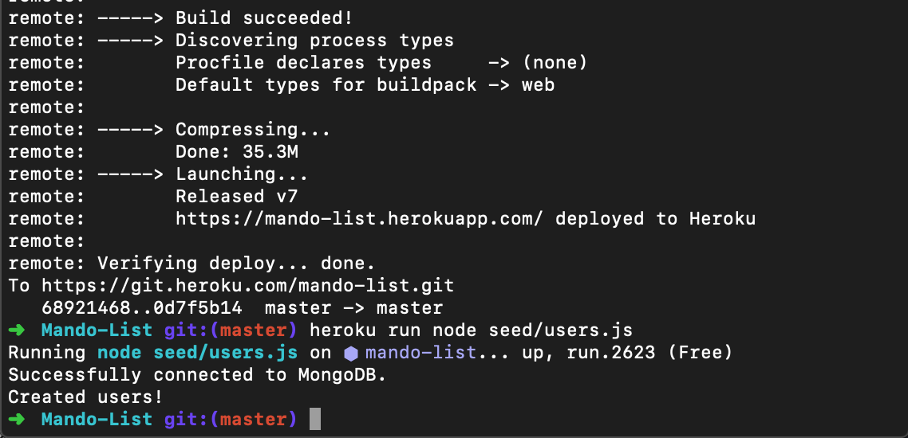

# eSwap

## Project Description

**eSwap** is an e-commerce site where you can create items, delete items from your own user profile, request another user's item, and swap items. Just like eBay you can search for things to bid on/request like electronic equipment, kitchen supplies, clothes, etc. Users will be split into 3 categories - admin, user (authenticated) and guest (unauthenticated). Guests are able to browse, but unable to bid on or upload items. Members are able to upload items for approval, and admins have the ability to update, delete and possibly edit items. Major challenges for the project included tying the backend together with the front-end of an e-commerce site as well as overscoping on the features. Post-mvp features include having an email screen that directly pops up on the website to request another user's item, “favoriting”/”liking” of items, having a watchlist for favorite items, swapping of items, and stripe implementation.  

## Relevant Instructions For Viewers:

**eSwap** is an e-commerce site where you, as the user, can create items on your own user profile, delete items from your own user profile, request another user's item, and swap items. The main page has a place to sign up for an account, sign in if you are re-visiting the site, and a search bar for the main database of items that each user has. If you are a user (authenticated) then you can create items to give away, request another user's items, and swap items with another user. If you are a guest (unauthenticated) then you can only view a list of items that are available via the search bar.

### MVP:
-Have a minimum of 1 git commit per day per team member  
-Have the frontend deployed on Surge 
-Have the backend deployed on Heroku 
-Include CRUD on the backend using Express, Mongoose, and MongoDB 
-Have hand-rolled jwt authentication system (included) 
-Use flexbox and/or css grid 
-Include a minimum of 5 components that your team has built 
-Use React Router (included) 
-Look like the mockup/wireframe (or better) 
-Be properly indented and spaced 
-Not include commented out code in the master branch 
-Use camelCase for javascript code 
-Use a color palette generator 
-Include a beautiful, professional README.md (use markdown) 

### Post-MVP:
-“Favoriting”/”Liking” option 
-Email screen within website so that user can request an item 
-Commenting underneath each item for enhanced/quicker user experience 
-Swapping of items 
_Implementing Stripe 

## Feature List 
-Sign Up 
-Sign In 
-Sign Out 
-User can refresh page and still stay signed in 
-Search bar to request items 
-Creating items 
-Retrieving items 
-Updating items 
-Deleting items 
-Email screen directly on website to request an item 
-“favoriting”/”liking” of items 
-Watchlist for favorite items 
-Swapping of items 
-Stripe implementation 

## Entity Relationship Diagram (ERD) 

### Items Database:
-Item ID (int) 
-Item Name (String) 
-Description (String) 
-Name(of owner) (String) 
-Date Uploaded (new Date) 
-Availability (Boolean) 

### Users Database:
-User ID (int) 
-User Name (String) 
-User Description/Role (admin/member/guest) (String)  
-Password 
-Date joined (new Date) 

## Wireframes 

https://marvelapp.com/a9jaafd/screen/67084205 

## Component Hierarchy 
_Wireframes should be broken into components which then should be described in a component hierarchy._ 

### Initial Component Hierarchy

Unauthenticated Navbar 
-->Sign Up 
-->Sign In 

Authenticated NavBar 
-->Home  
-->Search Items 
-->View User Items 
-->Sign Out 

App Container 
|Items 
  -->Product name 
  -->Value 
  -->Profile picture 
  -->Category_id 
|Floating Footer 
  -->Add item button  
  -->Homepage button  
  -->Back button 
|Footer  
  -->Branding copyright  
  -->Social media links  
  -->NavLinks  

## List Dependencies 

eBay RESTful API: (https://developer.ebay.com/api-docs/static/ebay-rest-landing.html) 

Craigslist API: (https://github.com/mislam/craigslist-api) 

Unsplash for images: (https://unsplash.com/)  

Faker for fake data: (https://faker.readthedocs.io/en/master/)  

MongoDb Database: (https://www.mongodb.com/)  

MongoDb Atlas: (https://www.mongodb.com/cloud/atlas)  

## Live Links

Surge(front-end): (http://eswap.surge.sh/)  

Heroku(Back-end): (https://mando-list.herokuapp.com/)  

Db Atlas (database):   
